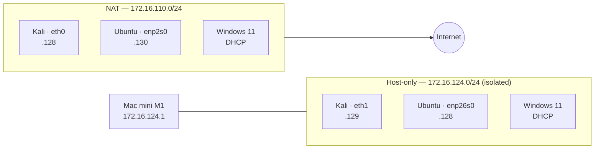

# Home Lab — Isolated Security Lab on Apple Silicon

Foundation lab for hands-on security work: three VMs, two network segments, and
documented reasoning for every architectural choice. Built on an Apple M1 host,
where most published lab guides do not apply.

**Stack:** VMware Fusion Pro · Kali Linux (ARM64) · Ubuntu Server LTS (ARM64) ·
Windows 11 Pro (ARM64) · Wireshark

---

## Problem

Practical security work needs a lab where traffic can be generated, captured and
analysed without touching a production or home network. Three constraints shaped
this build:

- **Isolation.** Attack simulations planned for later modules (brute force,
  script execution) must not be able to reach the home LAN or the internet. A
  mistyped scan range should stay contained.
- **Signal quality.** Packet capture is only useful if the capture set contains
  the traffic under test and little else.
- **ARM64 host.** Nearly every home lab guide assumes x86. On Apple Silicon,
  VirtualBox is unstable, Proxmox needs separate hardware, and the standard
  Windows evaluation image will not boot at all. The platform had to be
  reasoned about from scratch rather than followed from a tutorial.

## Approach

**Hypervisor:** VMware Fusion Pro (free for personal use) — native ARM support,
with snapshots and host-only networking available directly in the GUI. Chosen
over VirtualBox (experimental ARM support), UTM (weak snapshot support) and
Proxmox (requires a dedicated x86 host).

**Network segmentation:** each VM carries two adapters. A NAT adapter provides
internet access for updates and tooling; a host-only adapter carries all lab
traffic. Everything under test runs on the isolated segment, and capture is bound
to that interface by name.

**Snapshot policy:** a `clean` snapshot after each install and first full update,
taken with the VM powered off, plus a snapshot before any change that is hard to
undo.

**Runtime policy:** at most two VMs running at once — 16 GB of host RAM shared
with macOS makes three concurrent guests impractical, and no exercise needs more
than an attacker/target pair.

Full reasoning, including rejected alternatives and resource allocation, is in
[DECISIONS.md](DECISIONS.md).

## Result

A working lab with verified isolation and a first capture analysed end to end.

**Isolation verified, not assumed.** `ip route` on each VM shows exactly one
default route, via the NAT interface. The host-only interface carries only a
route to its own subnet — no default route means no traffic leaves the lab
through that adapter.

**First capture** ([`captures/lab-first-capture.pcapng`](captures/lab-first-capture.pcapng)):
an SSH session from Kali to Ubuntu across the isolated segment, captured on the
host-only interface and read layer by layer.

| Packets | What they show |
|---|---|
| 13–14 | ARP request and reply — `who has 172.16.124.128` answered with a MAC address. Layer 2 resolution before any IP traffic can flow. |
| 15–17 | TCP three-way handshake, SYN → SYN/ACK → ACK, ephemeral port 50610 to port 22. |
| 18, 20 | SSH version banners exchanged in cleartext — both endpoints disclose their OpenSSH version before any encryption is negotiated. |
| 22 onward | Key exchange, then `New Keys`. Everything past this point is opaque, including authentication. |

The cleartext banner is worth noting: version disclosure happens before
encryption is established, which is exactly what service fingerprinting relies
on during reconnaissance.

Command reference built up while diagnosing this lab:
[`notes/networking-commands.md`](notes/networking-commands.md).

## What I Learned

**An interface can be UP with no address, and that distinction is diagnostic.**
Kali's second adapter showed as UP — link established, layer 2 fine — but had no
IP. Working up through `ip link` → `ip a` → `ip route` → `ip neigh` locates the
failing layer in seconds, instead of guessing at cables and switches.

**"Only one adapter can connect" was a wrong conclusion from a real symptom.**
NetworkManager's default profile is not bound to any device, and a profile can
only be active on one device at a time — so activating it on the second NIC
silently moved it off the first. Creating one profile per NIC, pinned with
`ifname`, fixed it permanently. The lesson generalises: a plausible explanation
of a symptom is not the same as its cause.

**Connection refused and connection timed out are different findings.** Refused
means the packet arrived and the host answered with a TCP RST — the network works
and the service is absent. Timed out means silence: filtered, or unreachable. One
separates a network problem from a service problem in a single step.

**Host-only is not full isolation, and the name says so.** Fusion's "Private to
my Mac" places the host itself in the subnet at `172.16.124.1`. It cuts the lab
off from the router and other devices, but the host stays reachable — a
deliberate trade-off, since capture and host access to lab services both depend
on it. Worth stating explicitly rather than assuming a stronger guarantee than
the configuration provides.

**Platform constraints cascade.** Choosing ARM64 ruled out the recommended
hypervisor, then the standard Windows image, then the installer path itself — the
Windows 11 ARM installer ships without a driver for VMware's virtual NIC, so
setup blocks on a network requirement that cannot be satisfied until VMware Tools
are installed after setup. Each of those had to be reasoned about, and none of
them appears in the guides written for x86 hosts.

---

## Next steps

- Static addressing on the host-only segment (DHCP leases shift across reboots,
  and agent-based tooling stores the manager's IP in configuration).
- Windows audit policy configuration for logon and process-creation events.
- Wazuh deployment, with this lab as the log source.
